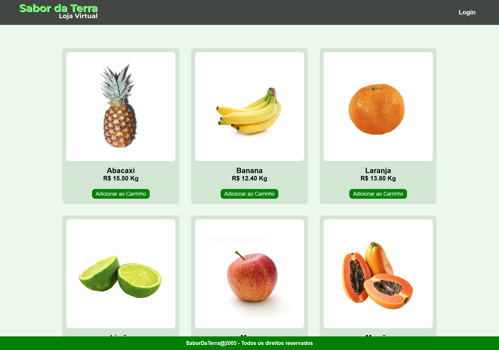

# Sabor da Terra App
## React Js

 

Acesse o projeto: [Sabor da Terra](https://sabor-da-terra-tau.vercel.app/) 

### 1. Sobre o projeto

- Navegação entre páginas;
- Uso de API fictícia em Json;
- Controle de estados da aplicação;
- Layout responsivo e organizado.

### 2. Dependências instaladas

- Axios;
- Redux;
- React Redux;
- React Router Dom.

### 3. Instalação do projeto

Instalar dependências: **npm install**

Rodar aplicação: **npm run dev**

### 4. Contatos

E-mail: [kba.2879@gmail.com](mailto:kba.2879@gmail.com) 
Linkedin: [/katarine-albuquerque](https://www.linkedin.com/in/katarine-albuquerque/)  
GitHub: [/katarinebalbuquerque](https://github.com/katarinebalbuquerque)  

